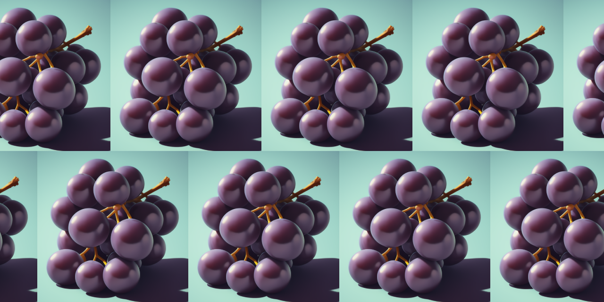
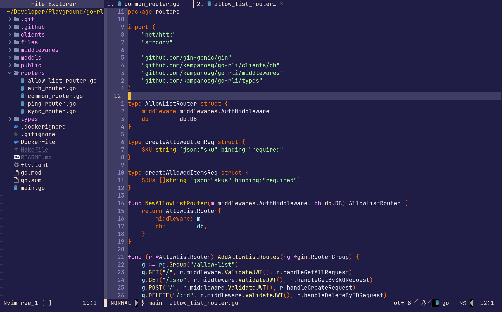
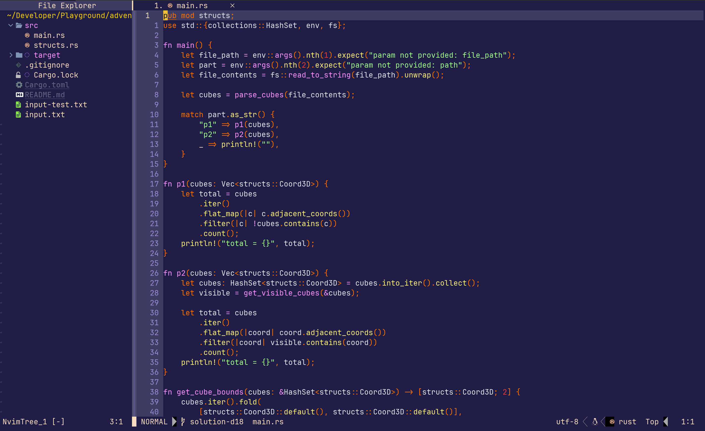

# grape.nvim 🍇



A deep-purple modern theme for Neovim. Comes in a single colour scheme. Inspired by the (awesome) [Shades of Purple](https://github.com/ahmadawais/shades-of-purple-vscode) theme for VS Code.

:warning: This is still under active development and things might change or be broken. Feel free to report any issues that you might find.

## Demo
### Golang


### Rust


## Usage

Add the theme to your Packer config and enable it
```lua
use {
    'kampanosg/grape.nvim',
    requires = 'tjdevries/colorbuddy.vim',
    config = function ()
        require('colorbuddy').colorscheme('grape')
    end
}
```
